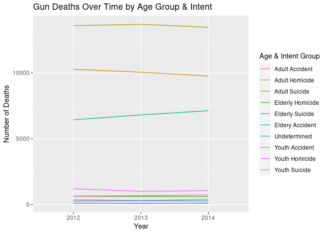
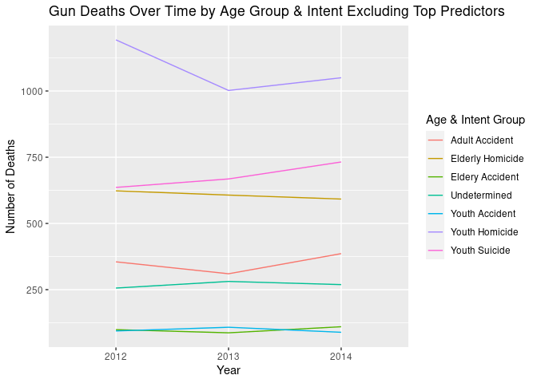
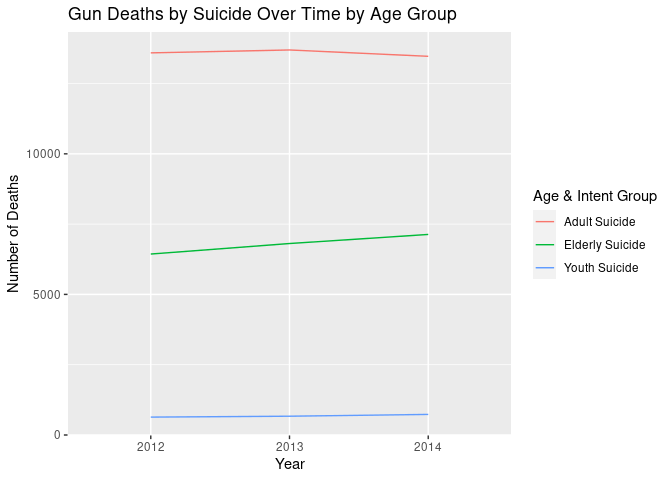
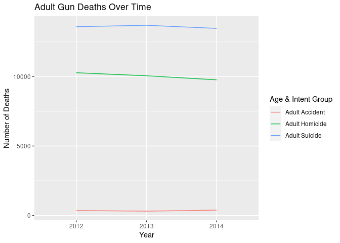
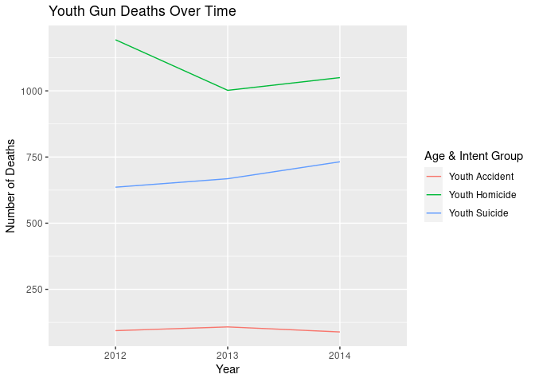

-   [Gun Deaths in the United States
    cont.](#gun-deaths-in-the-united-states-cont.)
    -   [Load necessary libraries](#load-necessary-libraries)
    -   [Read the cleaned CSV](#read-the-cleaned-csv)
    -   [Plot One](#plot-one)
    -   [Plot Two](#plot-two)
    -   [Plot Three](#plot-three)
    -   [Plot Four](#plot-four)
    -   [Plot Five](#plot-five)

# Gun Deaths in the United States cont.

## Load necessary libraries

    library(tidyverse)
    library(rcis)

## Read the cleaned CSV

    clean_gun_deaths <- read.csv("clean_gun_deaths.csv")
    head(clean_gun_deaths)

    ##   id year month  intent sex age                           race           place
    ## 1  1 2012   Jan Suicide   M  34         Asian/Pacific Islander            Home
    ## 2  2 2012   Jan Suicide   F  21                          White          Street
    ## 3  3 2012   Jan Suicide   M  60                          White Other specified
    ## 4  4 2012   Feb Suicide   M  64                          White            Home
    ## 5  5 2012   Feb Suicide   M  31                          White Other specified
    ## 6  6 2012   Feb Suicide   M  17 Native American/Native Alaskan            Home
    ##      education police_recode        category
    ## 1          BA+            No   Adult Suicide
    ## 2 Some college            No   Adult Suicide
    ## 3          BA+            No Elderly Suicide
    ## 4          BA+            No Elderly Suicide
    ## 5       HS/GED            No   Adult Suicide
    ## 6 Less than HS            No   Youth Suicide

Read the CSV we wrote in the `css_final_project.Rmd` file.

## Plot One

    category_by_year <- clean_gun_deaths %>% 
      filter(!is.na(category)) %>% 
      group_by(year, category) %>% 
      summarize(count = n(), .groups = "drop")

    ggplot(category_by_year,
           mapping = aes(
             x = factor(year),
             y = count,
             color = category,
             group = category)) +
      geom_line() +
      labs(
        title = "Gun Deaths Over Time by Age Group & Intent",
        x = "Year",
        y = "Number of Deaths",
        color = "Age & Intent Group")

 I wanted
to plot the category variable I created, which documents form of intent
by age group, so I plotted how the number of deaths per category has
changed over the three years documented in the dataset. This line graph
reveals that three types of firearm deaths occurred the most frequently:
Adult Suicide, with an average of about 12,500 deaths, Adult Homicide,
with an average of about 10,000 deaths, and Elderly Suicide, with an
average of about 7,000 deaths. Unfortunately, because each of these
categories had such high numbers of deaths, the rest of the categories’
data is somewhat unreadable. We’ll address this problem in the next few
plots, but for now, we’ll analyze this plot. Elderly Suicide appears to
be the only age group and intent category that increases throughout the
timeline of the dataset. Adult Homicide and Youth Homicide appear to
decrease throughout the timeline, while the other age group and intent
categories appear to remain constant, but it is hard to tell with the
bottom few lines because so many of them are on top of each other.

    category_summary <- category_by_year %>% 
      group_by(category) %>% 
      summarize(
        mean = mean(count, na.rm = TRUE),
        min = min(count, na.rm = TRUE),
        max = max(count, na.rm = TRUE),
        .groups = "drop"
      )

    knitr::kable(
      category_summary,
      caption = "Summary Statistics of Gun Deaths by Category")

<table>
<caption>Summary Statistics of Gun Deaths by Category</caption>
<thead>
<tr class="header">
<th style="text-align: left;">category</th>
<th style="text-align: right;">mean</th>
<th style="text-align: right;">min</th>
<th style="text-align: right;">max</th>
</tr>
</thead>
<tbody>
<tr class="odd">
<td style="text-align: left;">Adult Accident</td>
<td style="text-align: right;">350.33333</td>
<td style="text-align: right;">310</td>
<td style="text-align: right;">386</td>
</tr>
<tr class="even">
<td style="text-align: left;">Adult Homicide</td>
<td style="text-align: right;">10033.33333</td>
<td style="text-align: right;">9766</td>
<td style="text-align: right;">10277</td>
</tr>
<tr class="odd">
<td style="text-align: left;">Adult Suicide</td>
<td style="text-align: right;">13584.33333</td>
<td style="text-align: right;">13468</td>
<td style="text-align: right;">13694</td>
</tr>
<tr class="even">
<td style="text-align: left;">Elderly Homicide</td>
<td style="text-align: right;">607.33333</td>
<td style="text-align: right;">592</td>
<td style="text-align: right;">623</td>
</tr>
<tr class="odd">
<td style="text-align: left;">Elderly Suicide</td>
<td style="text-align: right;">6793.00000</td>
<td style="text-align: right;">6436</td>
<td style="text-align: right;">7133</td>
</tr>
<tr class="even">
<td style="text-align: left;">Eldery Accident</td>
<td style="text-align: right;">98.66667</td>
<td style="text-align: right;">87</td>
<td style="text-align: right;">110</td>
</tr>
<tr class="odd">
<td style="text-align: left;">Undetermined</td>
<td style="text-align: right;">268.66667</td>
<td style="text-align: right;">256</td>
<td style="text-align: right;">281</td>
</tr>
<tr class="even">
<td style="text-align: left;">Youth Accident</td>
<td style="text-align: right;">97.00000</td>
<td style="text-align: right;">89</td>
<td style="text-align: right;">108</td>
</tr>
<tr class="odd">
<td style="text-align: left;">Youth Homicide</td>
<td style="text-align: right;">1081.66667</td>
<td style="text-align: right;">1002</td>
<td style="text-align: right;">1193</td>
</tr>
<tr class="even">
<td style="text-align: left;">Youth Suicide</td>
<td style="text-align: right;">678.66667</td>
<td style="text-align: right;">636</td>
<td style="text-align: right;">732</td>
</tr>
</tbody>
</table>

Summary Statistics of Gun Deaths by Category

I examined the summary statistics of these categories in a table,
calculating the mean, minimum, and maximum number of deaths per year.
This table gives us a better picture as to what the average number of
deaths per category actually are. We can see that I estimated the
averages of the categories with the highest number of deaths somewhat
accurately. This table also helps us see the average number of deaths in
the categories that were less visible in the original plot. For
instance, now we can see that the lowest average number of deaths
include Elderly Accident and Youth Accident. We can also see that
suicide was the intent that killed the highest number of adults and
elderly individuals, but killed only half as many people as homicide did
in the Youth categories. From the minimums and maximums, we can see that
the number of deaths did not change much from year to year, with the
biggest difference being an average of 6,793 and a maximum of 7,133
deaths in the Elderly Suicide category, reflecting what we saw in the
original plot.

## Plot Two

    category_by_year_low <- clean_gun_deaths %>% 
      filter(!category %in% c("Adult Suicide", "Adult Homicide", "Elderly Suicide")) %>% 
      filter(!is.na(category)) %>% 
      group_by(year, category) %>% 
      summarize(count = n(), .groups = "drop")

    ggplot(category_by_year_low,
           mapping = aes(
             x = factor(year),
             y = count,
             color = category,
             group = category)) +
      geom_line() +
      labs(
        title = "Gun Deaths Over Time by Age Group & Intent Excluding Top Predictors",
        x = "Year",
        y = "Number of Deaths",
        color = "Age & Intent Group")

 I
excluded the three categories with the highest number of deaths - Adult
Suicide, Adult Homicide, and Elderly Suicide - to get a better look at
the less visible categories in the original plot. Here, we can see that
Youth Homicide now has the highest number of deaths, with an average of
about 1,000 deaths each year. Youth Homicide decreases by a substantial
amount from 2012 to 2013, and then increases minimally in 2014. Youth
Suicide has the second highest number of deaths, which only increases to
about 750 deaths in 2014. Clearly, gun deaths affecting those under the
age of 18 is a problem. Elderly Homicide, Undetermined, and Youth
Accident all seem to decrease by 2014, but Adult Accident and Elderly
Accident appear to increase by 2014, with similar lulls to Youth
Homicide in 2013.

## Plot Three

    category_by_year_suicide <- clean_gun_deaths %>% 
      filter(category %in% c("Youth Suicide", "Adult Suicide", "Elderly Suicide")) %>% 
      group_by(year, category) %>% 
      summarize(count = n(), .groups = "drop")

    ggplot(category_by_year_suicide,
           mapping = aes(
             x = factor(year),
             y = count,
             color = category,
             group = category)) +
      geom_line() +
      labs(
        title = "Gun Deaths by Suicide Over Time by Age Group",
        x = "Year",
        y = "Number of Deaths",
        color = "Age & Intent Group")

 Per
one of my research questions, I wanted to investigate if certain
demographic characteristics lend themselves to a likelihood to commit
suicide. In this plot, I investigate if age group may play a role in
this likelihood. Indeed it does, with Adult Suicide resulting in nearly
15,000 deaths every year in this timeline. Elderly Suicide averaged
about 7,000 deaths per year, while Youth Suicide averaged only about 700
deaths per year. This indicates that adults are the most likely age
group to commit suicide, and youths under 18 are the least likely.
Elderly Suicide, however, is the only age group where deaths by suicide
are substantially increasing year to year.

## Plot Four

    category_by_year_adult <- clean_gun_deaths %>% 
      filter(category %in% c("Adult Homicide", "Adult Suicide", "Adult Accident")) %>% 
      group_by(year, category) %>% 
      summarize(count = n(), .groups = "drop")

    ggplot(category_by_year_adult,
           mapping = aes(
             x = factor(year),
             y = count,
             color = category,
             group = category)) +
      geom_line() +
      labs(
        title = "Adult Gun Deaths Over Time",
        x = "Year",
        y = "Number of Deaths",
        color = "Age & Intent Group")

 Given
this result that adults are the most likely to commit suicide, I wanted
to plot the other forms of intent committed by adults and compare the
number of deaths they produce. Again, we see Adult Suicide with the
highest number of deaths at nearly 15,000 deaths per year. Adult
Homicide follows not too far behind with about 10,000 deaths per year,
both of these forms of intent decreasing at nearly the same speed. Adult
Accident is one of the categories with the lowest number of deaths, at
about 350 deaths, but it is just barely increasing. Therefore, we can
conclude that not only are adults the most likely to commit suicide, but
they are more likely to commit suicide than any other intent.

## Plot Five

    category_by_year_adult <- clean_gun_deaths %>% 
      filter(category %in% c("Youth Homicide", "Youth Suicide", "Youth Accident")) %>% 
      group_by(year, category) %>% 
      summarize(count = n(), .groups = "drop")

    ggplot(category_by_year_adult,
           mapping = aes(
             x = factor(year),
             y = count,
             color = category,
             group = category)) +
      geom_line() +
      labs(
        title = "Youth Gun Deaths Over Time",
        x = "Year",
        y = "Number of Deaths",
        color = "Age & Intent Group")

 To
contrast with this comparison of intents used by adults, I wanted to
examine the number of deaths produced by different forms of intent used
by youths under 18 years old. Unlike adults and the elderly, where
suicide is most frequently used, Youth Homicide appear to result in the
highest number of deaths among youths each year, with an average of
about 1,000 deaths. This number dropped in 2013, but was again on the
rise in 2014. Youth Suicide results in the second highest number of
deaths among youths, with an average of about 700 deaths. This number
unfortunately rose in both 2013 and 2014. Youth Accident represents the
smallest number of deaths at about 90 deaths, and luckily declined from
2013 to 2014.
