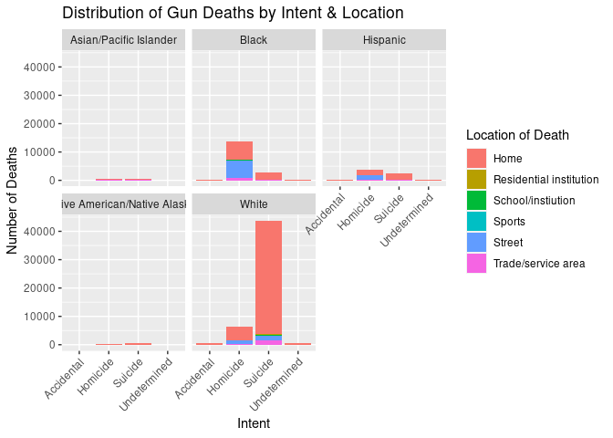

-   [Gun Deaths in the United States](#gun-deaths-in-the-united-states)
    -   [Research Questions](#research-questions)
    -   [Project Description](#project-description)
    -   [Data Description](#data-description)
    -   [Load necessary libraries](#load-necessary-libraries)
    -   [Explore the data](#explore-the-data)
    -   [View the data in table format](#view-the-data-in-table-format)
    -   [Clean the data](#clean-the-data)
    -   [Write the CSV](#write-the-csv)
    -   [View the clean data in table
        format](#view-the-clean-data-in-table-format)
    -   [Plot One](#plot-one)
    -   [Plot Two](#plot-two)
    -   [Plot Three](#plot-three)
    -   [Plot Four](#plot-four)
    -   [Plot Five](#plot-five)
    -   [Plot Six](#plot-six)
    -   [Plot Seven](#plot-seven)
    -   [Conclusion](#conclusion)
    -   [Resources](#resources)

# Gun Deaths in the United States

## Research Questions

My research question asks: How do victims of gun violence differ
demographically? Are some members of the population more likely to be
shot (by themselves or others) than others? Are some individuals’ deaths
more likely to have resulted from an officer-involved shooting? Are some
individuals more likely to commit suicide?

## Project Description

I will be examining the dataset `gun_deaths` to look for indication that
some members of the population, based on their demographics, are more
likely to die by firearm than others, and moreover, that some are more
likely to die at the hands of a police officer’s firearm, or even their
own hands. `gun_deaths` largely documents categorical variables (intent,
sex, race, place, education), making bar plots and histograms very
useful (and scatterplots far less so) for displaying data from this
dataset.

## Data Description

The data is from the rcis library, sourced from [Five Thirty
Eight](http://fivethirtyeight.com/features/gun-deaths/). The dataset
includes records on all firearm deaths in the United States from 2012 to
2014. The variable descriptions are as follows:

-   id: Row number of the observation
-   year: Year the death occurred
-   month: Month the death occurred
-   intent: Intent of the death (homicide, suicide, accidental, unknown)
-   police: Indicator if the death was the result of an officer-involved
    shooting
-   sex: Victim’s sex
-   age: Victim’s age
-   race: Victim’s race (White, Black, Hispanic, Asian/Pacific Islander,
    Native American/Native Alaskan)
-   place: Location where the shooting occurred
-   education:Highest level of education of the victim

## Load necessary libraries

    library(tidyverse)
    library(rcis)

## Explore the data

    data(gun_deaths)
    head(gun_deaths)

    ## # A tibble: 6 × 10
    ##      id  year month intent  police sex     age race              place education
    ##   <dbl> <dbl> <chr> <chr>    <dbl> <chr> <dbl> <chr>             <chr> <fct>    
    ## 1     1  2012 Jan   Suicide      0 M        34 Asian/Pacific Is… Home  BA+      
    ## 2     2  2012 Jan   Suicide      0 F        21 White             Stre… Some col…
    ## 3     3  2012 Jan   Suicide      0 M        60 White             Othe… BA+      
    ## 4     4  2012 Feb   Suicide      0 M        64 White             Home  BA+      
    ## 5     5  2012 Feb   Suicide      0 M        31 White             Othe… HS/GED   
    ## 6     6  2012 Feb   Suicide      0 M        17 Native American/… Home  Less tha…

    glimpse(gun_deaths)

    ## Rows: 100,798
    ## Columns: 10
    ## $ id        <dbl> 1, 2, 3, 4, 5, 6, 7, 8, 9, 10, 11, 12, 13, 14, 15, 16, 17, 1…
    ## $ year      <dbl> 2012, 2012, 2012, 2012, 2012, 2012, 2012, 2012, 2012, 2012, …
    ## $ month     <chr> "Jan", "Jan", "Jan", "Feb", "Feb", "Feb", "Feb", "Mar", "Feb…
    ## $ intent    <chr> "Suicide", "Suicide", "Suicide", "Suicide", "Suicide", "Suic…
    ## $ police    <dbl> 0, 0, 0, 0, 0, 0, 0, 0, 0, 0, 0, 0, 0, 0, 0, 0, 0, 0, 0, 0, …
    ## $ sex       <chr> "M", "F", "M", "M", "M", "M", "M", "M", "M", "M", "M", "M", …
    ## $ age       <dbl> 34, 21, 60, 64, 31, 17, 48, 41, 50, NA, 30, 21, 43, 34, 27, …
    ## $ race      <chr> "Asian/Pacific Islander", "White", "White", "White", "White"…
    ## $ place     <chr> "Home", "Street", "Other specified", "Home", "Other specifie…
    ## $ education <fct> BA+, Some college, BA+, BA+, HS/GED, Less than HS, HS/GED, H…

    ?gun_deaths

## View the data in table format

    knitr::kable(
      gun_deaths[1:5,],
      caption = "Gun Deaths")

<table>
<caption>Gun Deaths</caption>
<colgroup>
<col style="width: 3%" />
<col style="width: 5%" />
<col style="width: 6%" />
<col style="width: 8%" />
<col style="width: 7%" />
<col style="width: 4%" />
<col style="width: 4%" />
<col style="width: 25%" />
<col style="width: 17%" />
<col style="width: 14%" />
</colgroup>
<thead>
<tr class="header">
<th style="text-align: right;">id</th>
<th style="text-align: right;">year</th>
<th style="text-align: left;">month</th>
<th style="text-align: left;">intent</th>
<th style="text-align: right;">police</th>
<th style="text-align: left;">sex</th>
<th style="text-align: right;">age</th>
<th style="text-align: left;">race</th>
<th style="text-align: left;">place</th>
<th style="text-align: left;">education</th>
</tr>
</thead>
<tbody>
<tr class="odd">
<td style="text-align: right;">1</td>
<td style="text-align: right;">2012</td>
<td style="text-align: left;">Jan</td>
<td style="text-align: left;">Suicide</td>
<td style="text-align: right;">0</td>
<td style="text-align: left;">M</td>
<td style="text-align: right;">34</td>
<td style="text-align: left;">Asian/Pacific Islander</td>
<td style="text-align: left;">Home</td>
<td style="text-align: left;">BA+</td>
</tr>
<tr class="even">
<td style="text-align: right;">2</td>
<td style="text-align: right;">2012</td>
<td style="text-align: left;">Jan</td>
<td style="text-align: left;">Suicide</td>
<td style="text-align: right;">0</td>
<td style="text-align: left;">F</td>
<td style="text-align: right;">21</td>
<td style="text-align: left;">White</td>
<td style="text-align: left;">Street</td>
<td style="text-align: left;">Some college</td>
</tr>
<tr class="odd">
<td style="text-align: right;">3</td>
<td style="text-align: right;">2012</td>
<td style="text-align: left;">Jan</td>
<td style="text-align: left;">Suicide</td>
<td style="text-align: right;">0</td>
<td style="text-align: left;">M</td>
<td style="text-align: right;">60</td>
<td style="text-align: left;">White</td>
<td style="text-align: left;">Other specified</td>
<td style="text-align: left;">BA+</td>
</tr>
<tr class="even">
<td style="text-align: right;">4</td>
<td style="text-align: right;">2012</td>
<td style="text-align: left;">Feb</td>
<td style="text-align: left;">Suicide</td>
<td style="text-align: right;">0</td>
<td style="text-align: left;">M</td>
<td style="text-align: right;">64</td>
<td style="text-align: left;">White</td>
<td style="text-align: left;">Home</td>
<td style="text-align: left;">BA+</td>
</tr>
<tr class="odd">
<td style="text-align: right;">5</td>
<td style="text-align: right;">2012</td>
<td style="text-align: left;">Feb</td>
<td style="text-align: left;">Suicide</td>
<td style="text-align: right;">0</td>
<td style="text-align: left;">M</td>
<td style="text-align: right;">31</td>
<td style="text-align: left;">White</td>
<td style="text-align: left;">Other specified</td>
<td style="text-align: left;">HS/GED</td>
</tr>
</tbody>
</table>

Gun Deaths

This table shows the first five cases of the `gun_deaths` dataset, all
from the beginning of 2012. While we are already seeing variation in the
age, place, education variables, the intent, police, sex, and race
variables even in a sample of the dataset reveal larger patterns about
gun deaths - that they are largely experienced by white males without
police involvement. While we cannot make assumptions about patterns of
intent quite yet, this table shows that all five of these victims of gun
violence died by suicide.

## Clean the data

    clean_gun_deaths <- gun_deaths %>% 
      mutate(police_recode = case_when(
        police == 1 ~ "Yes",
        police == 0 ~ "No",
        TRUE ~ NA_character_)) %>% 
      select(-police)
    head(clean_gun_deaths)

    ## # A tibble: 6 × 10
    ##      id  year month intent  sex     age race       place education police_recode
    ##   <dbl> <dbl> <chr> <chr>   <chr> <dbl> <chr>      <chr> <fct>     <chr>        
    ## 1     1  2012 Jan   Suicide M        34 Asian/Pac… Home  BA+       No           
    ## 2     2  2012 Jan   Suicide F        21 White      Stre… Some col… No           
    ## 3     3  2012 Jan   Suicide M        60 White      Othe… BA+       No           
    ## 4     4  2012 Feb   Suicide M        64 White      Home  BA+       No           
    ## 5     5  2012 Feb   Suicide M        31 White      Othe… HS/GED    No           
    ## 6     6  2012 Feb   Suicide M        17 Native Am… Home  Less tha… No

To clean the data, I started off by recoding the binary `police`
variable, a column of doubles, into a string of “Yes” or “No”, a column
of characters, representing police presence in firearm deaths more
clearly to ensure readability for the plots. I removed the original
police variable to eliminate redundancy using `select()`.

    unique(clean_gun_deaths$intent)

    ## [1] "Suicide"      "Undetermined" "Accidental"   "Homicide"     NA

For the next step of cleaning, I needed to determine what the unique
observations were within the intent column so I could create a new
column grouped by intent and age group.

    clean_gun_deaths$category <- NA

    for (i in 1:nrow(clean_gun_deaths)) {
      age <- clean_gun_deaths$age[i]
      intent <- clean_gun_deaths$intent[i]
      
      if (!is.na(age) && !is.na(intent)) {
        if (age <= 18 && intent == "Suicide") {
          clean_gun_deaths$category[i] <- "Youth Suicide"}
        else if (age > 18 && age < 60 && intent == "Suicide") {
          clean_gun_deaths$category[i] <- "Adult Suicide"}
        else if (age >= 60 && intent == "Suicide") {
          clean_gun_deaths$category[i] <- "Elderly Suicide"}
        else if (age <= 18 && intent == "Accidental") {
          clean_gun_deaths$category[i] <- "Youth Accident"}
        else if (age > 18 && age < 60 && intent == "Accidental") {
          clean_gun_deaths$category[i] <- "Adult Accident"}
        else if (age >= 60 && intent == "Accidental") {
          clean_gun_deaths$category[i] <- "Eldery Accident"}
        else if (age <= 18 && intent == "Homicide") {
          clean_gun_deaths$category[i] <- "Youth Homicide"}
        else if (age > 18 && age < 60 && intent == "Homicide") {
          clean_gun_deaths$category[i] <- "Adult Homicide"}
        else if (age >= 60 && intent == "Homicide") {
          clean_gun_deaths$category[i] <- "Elderly Homicide"}
        else {
          clean_gun_deaths$category[i] <- "Undetermined"}}
      else {
        clean_gun_deaths$category[i] <- NA}}

    head(clean_gun_deaths)

    ## # A tibble: 6 × 11
    ##      id  year month intent  sex     age race       place education police_recode
    ##   <dbl> <dbl> <chr> <chr>   <chr> <dbl> <chr>      <chr> <fct>     <chr>        
    ## 1     1  2012 Jan   Suicide M        34 Asian/Pac… Home  BA+       No           
    ## 2     2  2012 Jan   Suicide F        21 White      Stre… Some col… No           
    ## 3     3  2012 Jan   Suicide M        60 White      Othe… BA+       No           
    ## 4     4  2012 Feb   Suicide M        64 White      Home  BA+       No           
    ## 5     5  2012 Feb   Suicide M        31 White      Othe… HS/GED    No           
    ## 6     6  2012 Feb   Suicide M        17 Native Am… Home  Less tha… No           
    ## # ℹ 1 more variable: category <chr>

I called this new column `category` which classifies each row by the age
and intent of the individual victim in that row. I first initialized the
new column with `NA` for all rows. I then created a for loop to iterate
through each indexed row in the dataset. I extracted the age and intent
variables from the dataset for the current row. I then use a conditional
statement to ensure that the age and intent of each row is available,
and if either are missing, the row is skipped and the category variable
is set to `NA`. The nested if/else statements then classify the row into
categories based on an age range and intent. For instance, if the victim
is under 18 years old and the intent is suicide, the category is set to
`Youth Suicide`. If none of the conditions are met, the category is set
to `Undetermined`, and if the age or intent variables are missing for
that row, the category is set to `NA`. I created this column to
generalize findings by age group, the plots for which can be seen in the
`category_plots.Rmd` file in this repository.

## Write the CSV

    write.csv(clean_gun_deaths, "clean_gun_deaths.csv", row.names = FALSE)

I wrote the cleaned dataset to a CSV.

## View the clean data in table format

    knitr::kable(
      clean_gun_deaths[1:5,],
      caption = "Clean Gun Deaths")

<table>
<caption>Clean Gun Deaths</caption>
<colgroup>
<col style="width: 2%" />
<col style="width: 4%" />
<col style="width: 5%" />
<col style="width: 7%" />
<col style="width: 3%" />
<col style="width: 3%" />
<col style="width: 20%" />
<col style="width: 14%" />
<col style="width: 11%" />
<col style="width: 12%" />
<col style="width: 14%" />
</colgroup>
<thead>
<tr class="header">
<th style="text-align: right;">id</th>
<th style="text-align: right;">year</th>
<th style="text-align: left;">month</th>
<th style="text-align: left;">intent</th>
<th style="text-align: left;">sex</th>
<th style="text-align: right;">age</th>
<th style="text-align: left;">race</th>
<th style="text-align: left;">place</th>
<th style="text-align: left;">education</th>
<th style="text-align: left;">police_recode</th>
<th style="text-align: left;">category</th>
</tr>
</thead>
<tbody>
<tr class="odd">
<td style="text-align: right;">1</td>
<td style="text-align: right;">2012</td>
<td style="text-align: left;">Jan</td>
<td style="text-align: left;">Suicide</td>
<td style="text-align: left;">M</td>
<td style="text-align: right;">34</td>
<td style="text-align: left;">Asian/Pacific Islander</td>
<td style="text-align: left;">Home</td>
<td style="text-align: left;">BA+</td>
<td style="text-align: left;">No</td>
<td style="text-align: left;">Adult Suicide</td>
</tr>
<tr class="even">
<td style="text-align: right;">2</td>
<td style="text-align: right;">2012</td>
<td style="text-align: left;">Jan</td>
<td style="text-align: left;">Suicide</td>
<td style="text-align: left;">F</td>
<td style="text-align: right;">21</td>
<td style="text-align: left;">White</td>
<td style="text-align: left;">Street</td>
<td style="text-align: left;">Some college</td>
<td style="text-align: left;">No</td>
<td style="text-align: left;">Adult Suicide</td>
</tr>
<tr class="odd">
<td style="text-align: right;">3</td>
<td style="text-align: right;">2012</td>
<td style="text-align: left;">Jan</td>
<td style="text-align: left;">Suicide</td>
<td style="text-align: left;">M</td>
<td style="text-align: right;">60</td>
<td style="text-align: left;">White</td>
<td style="text-align: left;">Other specified</td>
<td style="text-align: left;">BA+</td>
<td style="text-align: left;">No</td>
<td style="text-align: left;">Elderly Suicide</td>
</tr>
<tr class="even">
<td style="text-align: right;">4</td>
<td style="text-align: right;">2012</td>
<td style="text-align: left;">Feb</td>
<td style="text-align: left;">Suicide</td>
<td style="text-align: left;">M</td>
<td style="text-align: right;">64</td>
<td style="text-align: left;">White</td>
<td style="text-align: left;">Home</td>
<td style="text-align: left;">BA+</td>
<td style="text-align: left;">No</td>
<td style="text-align: left;">Elderly Suicide</td>
</tr>
<tr class="odd">
<td style="text-align: right;">5</td>
<td style="text-align: right;">2012</td>
<td style="text-align: left;">Feb</td>
<td style="text-align: left;">Suicide</td>
<td style="text-align: left;">M</td>
<td style="text-align: right;">31</td>
<td style="text-align: left;">White</td>
<td style="text-align: left;">Other specified</td>
<td style="text-align: left;">HS/GED</td>
<td style="text-align: left;">No</td>
<td style="text-align: left;">Adult Suicide</td>
</tr>
</tbody>
</table>

Clean Gun Deaths

While we still cannot make assumptions about the dataset from these five
cases, we can more easily see that all of these suicides occurred among
adults or the elderly, and none occurred among youth, as well as that
none of these instances of gun violence involved police officers.

## Plot One

    age_intent <- clean_gun_deaths %>%
      filter(!is.na(intent)) %>% 
      group_by(intent) %>%
      summarize(avg_age = mean(age, na.rm = TRUE))
    age_intent

    ## # A tibble: 4 × 2
    ##   intent       avg_age
    ##   <chr>          <dbl>
    ## 1 Accidental      38.0
    ## 2 Homicide        32.6
    ## 3 Suicide         50.3
    ## 4 Undetermined    40.2

    knitr::kable(
      age_intent,
      caption = "Intent by Average Age")

<table>
<caption>Intent by Average Age</caption>
<thead>
<tr class="header">
<th style="text-align: left;">intent</th>
<th style="text-align: right;">avg_age</th>
</tr>
</thead>
<tbody>
<tr class="odd">
<td style="text-align: left;">Accidental</td>
<td style="text-align: right;">38.04335</td>
</tr>
<tr class="even">
<td style="text-align: left;">Homicide</td>
<td style="text-align: right;">32.62021</td>
</tr>
<tr class="odd">
<td style="text-align: left;">Suicide</td>
<td style="text-align: right;">50.31092</td>
</tr>
<tr class="even">
<td style="text-align: left;">Undetermined</td>
<td style="text-align: right;">40.23821</td>
</tr>
</tbody>
</table>

Intent by Average Age

For the first plot, I wanted to analyze the relationship between the
intent behind the firearm death and the average age that each form of
intent was committed at. Therefore, I filtered out the missing values,
grouped by the intent variable, and calculated the mean age for each
intent. I then generated a table for these summary statistics and found
that homicide tends to produce the youngest victims, with an average age
of about 33 years old, suicide produces the oldest victims by far, with
an average age of about 50 years old.

    ggplot(age_intent %>% 
             filter(!is.na(avg_age) & !is.na(intent)),
           mapping = aes(
             x = intent,
             y = avg_age,
             fill = intent)) +
      geom_col() +
      labs(
        title = "Gun Death Intent by Average Age",
        x = "Intent",
        y = "Average Age",
        fill = "Intent")

 I
wanted to plot these results from the table I generated, and this bar
plot confirms that suicide has, by at least 10 years more than the other
forms of intent, the oldest victims, averaging to about 50 years old.
While accidents and undetermined intent hover in the middle with
accidents slightly lower, homicide continues to produce the youngest
victims, averaging to just above 30 years old.

## Plot Two

    count_female_vics <- function(data) {
      female_vics <- data %>%
        filter(sex == "F") %>%
        count()
      return(female_vics)
    }
    count_female_vics(clean_gun_deaths)

    ## # A tibble: 1 × 1
    ##       n
    ##   <int>
    ## 1 14449

Because we only saw one female victim represented in our initial table,
and based on public knowledge that males are more likely to be victims
of all kinds of firearm deaths but particularly homicide and suicide, I
wanted to see how many gun violence victims in the dataset were female.
So, I utilized a function to filter the sex variable to only count rows
that were labeled with the string `"F"` to indicate female victims. Out
of the 100,798 rows and thus victims in this dataset, only 14,449 were
female victims of gun violence.

    ggplot(clean_gun_deaths %>% 
             filter(!is.na(intent)),
           mapping = aes(
             x = sex,
             fill = intent)) +
      geom_bar(position = "dodge") +
      labs(
        title = "Gun Deaths by Sex & Intent",
        x = "Sex",
        y = "Number of Deaths",
        fill = "Intent")

 I
wanted to confirm my suspicious and public knowledge that most firearm
deaths involve male victims who die by suicide or homicide, so I plotted
the relationship between the sex and intent variables. Suicide is
clearly the most frequent form of intent for both males and females, but
male victims of suicide are far more frequent than female. The same goes
for the runner up, homicide, where suicide is almost twice as likely to
occur than homicide within each sex, but males are much more likely to
be victims of homicide than females. Accidental deaths and deaths by an
undetermined intent are negligible.

## Plot Three

    ggplot(clean_gun_deaths %>% 
             filter(!is.na(education)),
           mapping = aes(
             x = sex,
             fill = education)) +
      geom_bar(position = "dodge") +
      labs(
        title = "Gun Deaths by Sex & Education of Victim",
        x = "Sex",
        y = "Number of Deaths",
        fill = "Education Level")

 To
add another layer of complexity to the analysis of gun violence victims
by sex, I wanted to analyze each sex by the group’s level of education
to see if education level might be an indicator as to who becomes
victimized by firearms. While victims of both sexes were most likely to
only have a high school degree or GED, indicating that these victims
were not very educated, beyond this point is where the sexes diverge.
Male victims were more likely to not have graduated high school than
female victims, with this being the second largest category for males
and the lowest for females. This means that male victims are less
educated than female victims, pointing to poor education as an indicator
for being victimized by gun violence. Next for the sexes is some
college, indicating that they dropped out before completing, which is
the second highest category for female victims and third highest
category for male victims. The lowest education level for male victims
is BA+, indicating an advanced degree, while BA+ is the third highest
education level for female victims. This plot shows that female victims
are more educated than male victims, which may be one factor
contributing to the fact that males are more likely to be victimized by
gun violence.

## Plot Four

    ggplot(clean_gun_deaths,
           mapping = aes(
             x = age,
             fill = police_recode)) +
      geom_histogram(position = "identity") +
      facet_wrap(~ race) +
      labs(
        title = "Age Distribution of Gun Deaths by Race & Police Involvement",
        x = "Age",
        y = "Number of Deaths",
        fill = "Police Involvement")

    ## `stat_bin()` using `bins = 30`. Pick better value with `binwidth`.

    ## Warning: Removed 18 rows containing non-finite values (`stat_bin()`).

 I
wanted to analyze police involvement in gun deaths by race, so I used my
recoded police variable in relationship with the age variable and
faceted the plot by race. We can see that victims of gun violence are
most likely to be white, with an average age of about 60 years old, with
black individuals the second most likely to be victimized by gun
violence but tending to be much younger, averaging at about 25 years
old. Hispanics are less likely to be victims, but still peak at about 25
years old. Asians/Pacific Islanders and Native Americans are the least
likely to be victims of gun violence. All of this considered, it appears
based on this plot that nearly no instances of gun deaths involve police
officers. In the majority of cases across all races, it appears that
police are largely not involved in or responsible for gun deaths, but
what happens when they are? While this plot gives us a good idea of how
race plays a part in the frequency of gun deaths, it does not give us a
clear picture of what happens when police are involved. So, I utilized a
boxplot to represent police involvement more clearly.

## Plot Five

    ggplot(clean_gun_deaths,
           mapping = aes(
             x = race,
             y = age,
             fill = police_recode)) +
      geom_boxplot() +
      labs(
        title = "Age Distribution of Gun Deaths by Race & Police Involvement",
        x = "Race",
        y = "Age",
        fill = "Police Involvement") +
      theme(axis.text.x = element_text(angle = 45, hjust = 1))

    ## Warning: Removed 18 rows containing non-finite values (`stat_boxplot()`).

 In
this boxplot, we have less indication of which races are most affected
by gun violence, but more indication that gun violence involving police
officers affects racial identities differently. While we could barely
see any evidence of police involvement in the previous plot, because
this plot only looks at age rather than both age and number of deaths in
relationship with the race variable, we are more able to distinguish
between cases involving or not involving a police presence. For
Asian/Pacific Islander, Native American, and White victims, police
involvement in their deaths is much less likely to occur. For Hispanic
victims, the likelihood of police being involved in their gun deaths is
about the same as the likelihood of them not being involved. Only for
Black victims is police involvement in their deaths more likely to
occur. From this plot we can also see more clearly that White victims
are more likely to die from gun violence when they are older, while
Black gun violence victims not involving the police have the lowest
minimum age, though they also have many much older outliers.
Interestingly, Native American victims with police involvement in their
deaths have the smallest and one of the lowest age ranges, with a median
of about 29 years old. While Hispanic gun violence victims not involving
the police have a larger interquartile range of age, the median age
within this group is also about 29 years old.

## Plot Six

    race_by_place <- clean_gun_deaths %>% 
      filter(!is.na(place)) %>% 
      filter(!place %in% c("Farm", "Industrial/construction", "Other specified", 
                           "Other unspecified")) %>% 
      group_by(race, place) %>% 
      summarize(count = n(), .groups = "drop")

    ggplot(race_by_place,
           mapping = aes(
             x = race,
             y = count,
             fill = place)) +
      geom_bar(stat = "identity", position = "stack") +
      labs(
        title = "Distribution of Gun Deaths by Race & Location",
        x = "Race",
        y = "Number of Deaths",
        fill = "Location of Death") +
      theme(
        axis.text.x = element_text(angle = 45, hjust = 1))

 As a
continued exploration into the race variable, I wanted to investigate
the relationship between the race of the victims and the locations where
they die. The victims’ homes stands out as the most likely place for
them to die for each racial identity, but taking up significantly more
space for White victims than other racial identities. The locations
where Asian/Pacific Islander and Native American victims die from gun
violence appear to stop at the home, perhaps because the sample size for
these racial groups is so small. The street is the second most likely
location for Black, Hispanic, and White victims, with Black victims
being the most likely to die on the street. White victims have the
second largest number of deaths that occur on the street despite this
location making up less of this racial group’s total makeup of deaths,
followed by Hispanic victims. Schools and trade/service areas follow,
with Black, White, and Hispanic victims having nearly the same
likelihood of dying at school, and White victims being the most likely
to die in a trade/service area (such as a store) with Black victims
close behind. Gun deaths in schools and trade/service areas may indicate
mass casualty events, where all races are somewhat equally likely to be
victimized. Looking at intent alongside these variables may clarify
this.

## Plot Seven

    intent_by_place <- clean_gun_deaths %>% 
      filter(!is.na(place) & !is.na(intent)) %>% 
      filter(!place %in% c("Farm", "Industrial/construction", "Other specified", 
                           "Other unspecified")) %>% 
      group_by(intent, place, race) %>% 
      summarize(count = n(), .groups = "drop")

    ggplot(intent_by_place,
           mapping = aes(
             x = intent,
             y = count,
             fill = place)) +
      geom_bar(stat = "identity", position = "stack") +
      labs(
        title = "Distribution of Gun Deaths by Intent & Location",
        x = "Intent",
        y = "Number of Deaths",
        fill = "Location of Death") +
      theme(
        axis.text.x = element_text(angle = 45, hjust = 1)) +
      facet_wrap(~ race)

Therefore, I plotted the relationship between the intent and location
variables and faceted by race. White victims of gun violence are far
more likely than any other racial group to commit suicide. Both White
and Native American victims are most likely to commit suicide compared
to other forms of intent, but the number of Native Americans (and
Asians/Pacific Islanders for that matter) that have died because of a
firearm is very small. Both Black and Hispanic victims of gun violence
are most likely to killed in a homicide, though Black victims are the
most likely to die by homicide out of any racial group. Homicide is
closely followed by suicide for Hispanic victims. This plot confirms
that most gun deaths for all racial groups occur in the home, with the
street trailing behind for White and Hispanic victims, while Black
victims are far more likely to die on the street than any other racial
group. Schools and trade/service areas make a small appearance for
Black, Hispanic, and White victims, and while trade/service areas are
more conducive to suicides for White victims, they are more conducive to
homicides for Black and Hispanic victims. While we cannot tell from this
dataset if these homicides were part of mass casualty events, it appears
that Black and Hispanic victims of gun violence may be more likely to
die in mass shootings than White victims when looking at the public
locations of where these homicides occurred. Future research may want to
consider exploring the relationship between race, intent, and location
in the context of mass shootings.

## Conclusion

My research question asked if certain demographic characteristics make
some members of the population more likely to die by gun violence. I
also asked if demographic characteristics played a role in the
likelihood of dying at one’s own hands by suicide or by a police
officer’s hands. From my analysis, it appears that white male adults
with a high school education are the most likely victims of gun
violence. Suicide is the most frequent cause of death from gun violence
across all races and sexes, but it is most likely to be committed by
white male adults averaging around 50 years old. When police are
involved in and thus responsible for a gun violence victim’s death,
however, the victim is most likely a Black adult, averaging around 30
years old.

## Resources

-   I primarily used the provided lecture slides to aid in my
    exploratory data analysis.
-   I used ChatGPT to debug the use of `&&` to check for logical values
    in the lines such as `(age <= 18 && intent == "Suicide")` in the
    conditional statements used to create the category variable.
-   I used ChatGPT to generate the code
    `theme(axis.text.x = element_text(angle = 45, hjust = 1))` which
    sets the x axis labels to a 45 degree angle so they are more
    readable when the labels are longer.
-   I used ChatGPT to figure out that I needed to set both the color and
    the group equal to the category variable in the category plots in
    order for the line plots to appear properly.
